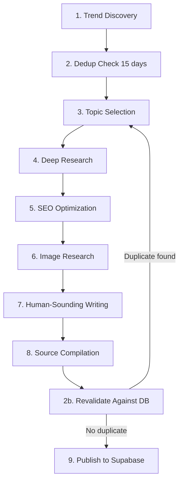

# Viral Blog Publisher

End-to-end pipeline to discover, research, write, and publish trending real estate blog posts for 360 Ghar.

## Workflow



### Step 1: Trend Discovery

Use `WebSearch` with multiple queries to find what's trending RIGHT NOW.

**Standard Market Queries:**
- `"Gurgaon real estate news today 2026"` — latest news
- `"Gurugram property market trending"` — viral discussions
- `"site:news.google.com Gurgaon property"` — Google News
- `"Haryana RERA latest update"` — policy changes
- `"Delhi NCR real estate viral"` — gossip/famous topics
- `"Gurgaon circle rate change 2026"` — data-driven stories

**Viral News Queries (HIGH PRIORITY — drives maximum traffic):**
- `"Gurgaon IT raid tehsil property 2026"` — I-T department searches, tax evasion probes
- `"Gurgaon builder fraud arrested 2026"` — developer arrests, cheating cases
- `"Gurgaon demolition drive illegal construction 2026"` — HC/SC orders, anti-encroachment
- `"ED attaches Gurgaon property money laundering 2026"` — Enforcement Directorate actions
- `"Gurgaon land mafia demolished 2026"` — land mafia crackdowns, GMDA/HSVP drives
- `"Gurgaon stilt plus 4 ban HC order 2026"` — regulatory shocks, construction policy
- `"Gurgaon property scam fraud crore 2026"` — large-scale scams, investor fraud
- `"Gurgaon property price bubble crash correction 2026"` — market controversy debates
- `"Gurgaon celebrity property purchase 2026"` — celebrity homes, high-profile transactions

Target 5-10 candidate topics per run. Prioritize stories with:
- High search volume indicators (multiple outlets covering same story)
- Recency (published today or yesterday)
- 360 Ghar platform relevance (areas/sectors where we have listings, data hub coverage)

**Topic Type Classification** — classify each discovered topic into one of these types (affects trending_score and writing style):

| Type | Description | Trending Score Range | Example |
|------|-------------|---------------------|---------|
| `breaking_scandal` | I-T raids, fraud arrests, ED attachments, scam exposes | 90-100 | "I-T dept detects ₹45K cr transaction discrepancies at Gurgaon tehsil" |
| `regulatory_shock` | HC/SC orders, demolition drives, policy bans, construction halts | 85-95 | "HC stays stilt+4 construction, 7,500 structures face demolition" |
| `market_controversy` | Bubble debates, price correction calls, affordability crises | 75-85 | "After 150% rally, is Gurgaon heading for a correction?" |
| `data_reveal` | Circle rate data, transaction discrepancies, registration stats | 70-80 | "Gurgaon circle rates hiked up to 75%" |
| `market_analysis` | Standard pricing, investment guides, sector comparisons | 60-80 | "Best sectors under 50 lakh in Gurgaon" |

Viral news types (`breaking_scandal`, `regulatory_shock`) should ALWAYS be prioritized over `market_analysis` when present — they drive 3-5x more traffic.

### Step 2: Dedup Check

Fetch existing blog posts from the **last 15 days** using one of:

**Option A — REST API (preferred when server is running):**
```
GET /api/v1/blog/posts?limit=100
```
Filter to posts with `created_at` within last 15 days.

**Option B — Direct DB query (when running script locally):**
```bash
uv run python -c "
import asyncio
from app.core.database import AsyncSessionLocal
from sqlalchemy import text
async def check():
    async with AsyncSessionLocal() as db:
        result = await db.execute(text(\"SELECT title, focus_keyword FROM blog_posts WHERE active=true AND created_at >= NOW() - INTERVAL '15 days' ORDER BY created_at DESC\"))
        for r in result.fetchall():
            print(f'Title: {r[0]} | Focus: {r[1]}')
asyncio.run(check())
"
```

Compare discovered topics against existing posts by:
- **Title overlap** — 3+ shared words with an existing title (case-insensitive)
- **Focus keyword overlap** — same or very similar focus_keyword
- **Topic-level overlap** — covering the same event/story even with a different angle (e.g., "circle rate hike impact" vs "circle rate sector-wise breakdown" are the same story)

Only titles and focus keywords are needed for dedup — no need to fetch full blog content. Skip any topic already covered. **The 15-day window catches repeats from parallel agents and recent runs — not just 7 days.**

### Step 2b: Post-Generation Revalidation (CRITICAL)

**Before publishing each blog, run a second dedup check.** This catches duplicates that slip through when multiple agents work in parallel (agents may select the same topic independently).

After writing the blog content and building the JSON payload, but **before** running `publish_blog.py`:

```bash
uv run python -c "
import asyncio
from app.core.database import AsyncSessionLocal
from sqlalchemy import text
async def revalidate():
    async with AsyncSessionLocal() as db:
        result = await db.execute(text(\"SELECT title, focus_keyword FROM blog_posts WHERE active=true AND created_at >= NOW() - INTERVAL '15 days'\"))
        existing = result.fetchall()
        new_title = 'YOUR_BLOG_TITLE_HERE'
        new_keyword = 'YOUR_FOCUS_KEYWORD_HERE'
        for r in existing:
            title_overlap = len(set(new_title.lower().split()) & set(r[0].lower().split()))
            keyword_match = new_keyword.lower() == (r[1] or '').lower()
            if title_overlap >= 3 or keyword_match:
                print(f'DUPLICATE DETECTED: {r[0]} (keyword: {r[1]})')
                break
        else:
            print('NO DUPLICATE - SAFE TO PUBLISH')
asyncio.run(revalidate())
"
```

If a duplicate is detected:
1. **Do NOT publish** the duplicate blog
2. Pick a different topic from your candidate list (go back to Step 3)
3. If no alternative topic is available, skip this blog and report the skip

This revalidation step is **mandatory** — it prevents the same story from being published twice when running multiple agents in parallel.

### Step 3: Topic Selection

From remaining candidates, rank by scoring:
- **Relevance to 360 Ghar** (0-3): Does the topic connect to sectors/areas where we have listings? Can we reference data hub, RERA, circle rates?
- **Search volume** (0-3): Are multiple outlets covering this? Does Google Trends show a spike?
- **Unique angle potential** (0-3): Can we offer something competitors can't (platform data, listings, tours)?
- **Timeliness** (0-1): Is this breaking news or a hot topic right now?

Select the highest-scoring topic.

### Step 4: Deep Research

Use `WebSearch` + `FetchUrl` to research deeply:

1. **Main story**: Search the topic, read top 5 articles via FetchUrl
2. **Data angle**: Search for related data on 360 Ghar platform:
   - `"site:360ghar.com [sector name]"` — existing listings
   - Circle rate data, RERA project status, neighbourhood scores
3. **Unique insight**: Find a specific fact, number, or perspective NOT in competitor articles
4. **Quotes/data**: Extract specific numbers, policy names, project details, dates

Record every source URL with name and type for structured sourcing.

### Step 5: SEO Optimization

Read `references/seo-playbook.md` for detailed methodology.

Determine for the selected topic:
1. **focus_keyword**: Primary target (e.g., "dwarka expressway property rates 2026")
2. **secondary_keywords**: 3-5 related terms for `seo_metadata.secondary_keywords`
3. **meta_title**: Max 60 chars, keyword-frontloaded
4. **meta_description**: Max 155 chars, includes keyword + CTA
5. **slug**: Focus keyword, hyphenated, max 5 words
6. **schema_markup type**: Article (default), FAQPage (if Q&A section), or HowTo (if guide)
7. **tags**: 5-8 specific tags including locality, topic, year
8. **categories**: 1-2 broad categories
9. **internal_links**: 3-5 slugs of related existing blog posts
10. **trending_score**: 0-100 based on current buzz level

### Step 6: Image Research & Selection

Every blog post MUST have a cover image. Search for a high-quality, free-to-use image:

1. **Search Pexels API first** (provides 1200×627 landscape — perfect for OG tags):
   ```
   GET https://api.pexels.com/v1/search?query={search_query}&per_page=5&orientation=landscape
   Header: Authorization: {PEXELS_API_KEY}
   ```
   Use `src.landscape` from the best result. Rate limit: 200 requests/hour.

2. **Fallback to Pixabay** (up to 1280px wide, higher rate limit — 5000 requests/hour):
   ```
   GET https://pixabay.com/api/?key={PIXABAY_API_KEY}&q={search_query}&image_type=photo&orientation=horizontal&min_width=800&min_height=400&per_page=5&safesearch=true
   ```
   Use `largeImageURL` from the best result.

3. **Search query strategy**: Derive from title + focus_keyword. Use the topic map in `scripts/blog_image_acquisition.py` to convert specific titles into generic real estate search terms. Examples:
   - "Inside Jasprit Bumrah's Home in Ahmedabad" → "luxury home interior"
   - "Sector 56 vs Sector 57 Gurgaon" → "residential area buildings"
   - "Vastu for Photo Frames" → "vastu home interior"

4. **Download and upload**: Download the image, verify it's a valid image file (not HTML), then upload to Supabase Storage `blog-covers/` bucket:
   ```bash
   # Using the acquisition script
   uv run python scripts/blog_image_acquisition.py --phase acquire --limit 1
   ```
   Or use `publish_blog.py --image-path local_image.jpg` when publishing a new blog.

5. **Set in payload**: `cover_image_url` and `og_image_url` = Supabase Storage public URL

6. **Add image source** to the sources array:
   ```json
   {"url": "https://www.pexels.com/photo/...", "name": "Pexels", "type": "image", "retrieved_at": "2026-05-13"}
   ```

### Step 7: Human-Sounding Writing

Read `references/writing-style.md` for detailed anti-AI patterns.

Write the blog following these rules:
- **Varied sentence length**: Mix 5-word and 25-word sentences
- **No banned AI phrases**: No "furthermore", "in today's landscape", "it's important to note"
- **Hook opening**: Start with a surprising stat, provocative question, or specific scene — never a generic intro
- **Specific over generic**: "Sector 79" not "certain sectors", "2.3 crore" not "significant prices"
- **Indian English**: Use "lakh/crore" (never "hundred thousand"), "Gurgaon/Gurugram" interchangeably
- **Opinions with confidence**: "This is the best sector for..." not "This could potentially..."
- **Honest uncertainty**: "The exact impact is unclear" when you don't know
- **Max 2 soft CTAs**: "Check live listings on 360 Ghar" — not aggressive sales
- **FAQ section**: 3-5 questions matching "People Also Ask" results

Output as clean HTML: `<p>`, `<h2>`, `<h3>`, `<ul>`, `<ol>`, `<li>`, `<strong>`, `<em>`, `<a>`, `<blockquote>`.

### Step 8: Source Compilation

Build structured sources array. Each source is:
```json
{"url": "https://...", "name": "Economic Times", "type": "article", "retrieved_at": "2026-05-13"}
```

Rules:
- Minimum 3 credible sources per post
- Block social-only sources: facebook.com, instagram.com, x.com, reddit.com, youtube.com
- Source types: `"primary"` (main story), `"article"`, `"government"`, `"data"`, `"image"`, `"video"`
- Include `retrieved_at` date for every source

### Step 9: Publish

Prepare a JSON file with all blog data and publish via the script:

```bash
# Dry run first to validate
uv run python .factory/skills/viral-blog-publisher/scripts/publish_blog.py --file blog_data.json --dry-run

# Publish for real
uv run python .factory/skills/viral-blog-publisher/scripts/publish_blog.py --file blog_data.json
```

The script does direct SQLAlchemy insert, auto-computes reading_time and word_count, handles slug uniqueness, and auto-creates categories/tags.

Alternatively, when the API server is running, POST to `/api/v1/blog/posts` with the same payload.

## Blog Data Schema

The complete JSON structure for `publish_blog.py`:

```json
{
  "title": "Catchy Display Title (can be longer)",
  "content": "<h2>Section</h2><p>HTML content...</p>",
  "excerpt": "Short summary for SERP and cards",
  "cover_image_url": "https://...",
  "meta_title": "SEO Title max 60 chars",
  "meta_description": "SERP snippet max 160 chars with keyword",
  "focus_keyword": "primary-target-keyword",
  "canonical_url": null,
  "og_image_url": "https://...",
  "categories": ["Real Estate", "Gurgaon"],
  "tags": ["dwarka-expressway", "property-rates", "2026", "gurgaon"],
  "sources": [
    {"url": "https://...", "name": "Source", "type": "primary", "retrieved_at": "2026-05-13"}
  ],
  "seo_metadata": {
    "schema_markup": {"@type": "Article", ...},
    "keyword_analysis": {"volume": "high", "difficulty": "medium"},
    "trending_score": 85.0,
    "secondary_keywords": ["kw2", "kw3"],
    "internal_links": ["existing-blog-slug-1", "existing-blog-slug-2"]
  },
  "active": true,
  "published_at": null,
  "publisher_user_id": null
}
```

## Existing Infrastructure

The blog system already has:
- **Auto-publish scheduler** (`app/services/blog_auto_publish.py`): Perplexity-based daily publisher — the skill is an on-demand upgrade to that
- **REST API** (`app/api/api_v1/endpoints/blog.py`): Full CRUD with categories, tags, and AI generation
- **Blog service** (`app/services/blog.py`): Core CRUD with auto slug, reading time, word count
- **Database model** (`app/models/blogs.py`): BlogPost with SEO fields (meta_title, meta_description, focus_keyword, canonical_url, og_image_url, reading_time_minutes, word_count, published_at, sources JSONB, seo_metadata JSONB)
